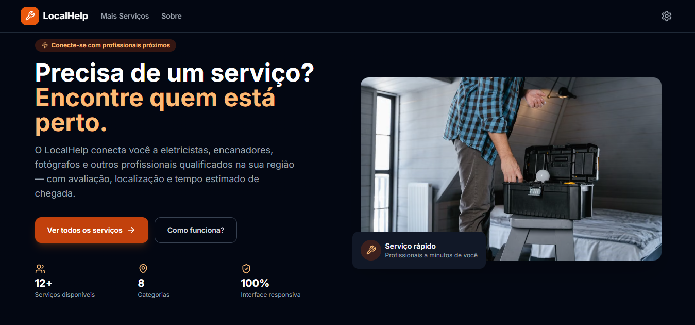
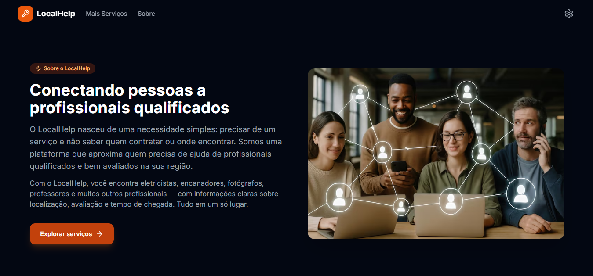
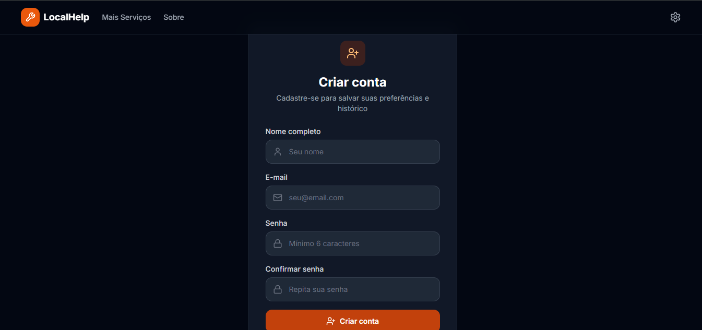

# LocalHelp

O LocalHelp é uma aplicação frontend para encontrar profissionais e serviços próximos. A interface reúne busca, avaliações, preços e informações de localização em um só lugar, com o objetivo de facilitar a escolha e o contato com prestadores de serviço.

> **Aviso:** este projeto é uma demonstração front-end. Os dados de profissionais e algumas operações, como cadastro, login e armazenamento de senhas, são simulados e não devem ser usados para gerenciar contas ou informações reais.

## O problema e a solução

Encontrar alguém confiável para resolver uma necessidade local pode exigir buscas em várias fontes e dificultar a comparação de preço, avaliação e distância. O LocalHelp explora uma solução para esse problema com uma vitrine única de profissionais: a pessoa pode filtrar e pesquisar serviços, comparar informações e abrir um trajeto aproximado até o prestador.

## Funcionalidades

- Página inicial com busca e profissionais em destaque.
- Catálogo de profissionais com busca por nome, serviço ou local.
- Filtros por categoria e ordenação por avaliação, distância ou tempo estimado de chegada.
- Cartões e páginas de detalhes com avaliações, preço inicial, localização e descrição.
- Visualização de trajeto em mapa, com tentativa de obter a localização do navegador.
- Acesso ao contato do profissional por WhatsApp.
- Páginas informativas, incluindo “Sobre”.
- Telas de cadastro, login e configurações de conta demonstrativas.
- Alternância entre tema claro e escuro.
- Formulário demonstrativo para receber novidades.
- Layout responsivo para telas menores, com navegação móvel.

## Capturas de tela

### Página inicial



### Catálogo de serviços


### Sobre o projeto



### Cadastro




## Tecnologias

- **React 18** e **TypeScript** para a interface.
- **Vite** para desenvolvimento e build.
- **TanStack Router** para navegação entre páginas.
- **Tailwind CSS** para estilos e responsividade.
- **React Hook Form** e **Zod** para formulários e validação.
- **Leaflet** para a visualização do mapa.
- **Lucide React** e **Simple Icons** para ícones.
- **localStorage** para simular a persistência da sessão e das contas.

## Arquitetura

O código está organizado por responsabilidade dentro de `src/`:

| Diretório | Responsabilidade |
| --- | --- |
| `components/` | Elementos reutilizáveis, como cabeçalho, rodapé, cartão de serviço e mapa. |
| `pages/` | Telas associadas às rotas da aplicação. |
| `router.tsx` | Definição das rotas e do layout compartilhado. |
| `contexts/` e `hooks/` | Estado compartilhado de autenticação, tema e utilitários de interface. |
| `services/` | Dados demonstrativos e serviços simulados de profissionais e autenticação. |
| `schemas/` | Schemas de validação dos formulários. |
| `types/` e `utils/` | Tipos e funções auxiliares. |
| `assets/screenshots/` | Capturas de tela usadas neste README. |

O layout raiz renderiza o cabeçalho e o rodapé em torno do conteúdo da rota. A autenticação é fornecida pelo `AuthProvider`; os serviços em `services/` simulam as respostas sem depender de uma API de produção.

## Como executar

### Pré-requisitos

- Node.js compatível com Vite 5.
- npm.

### Instalação e desenvolvimento

Na pasta do projeto, instale as dependências e inicie o servidor:

```bash
npm install
npm run dev
```

Abra no navegador o endereço indicado pelo Vite (normalmente `http://localhost:5173`).

### Verificações adicionais

```bash
npm run typecheck
npm run lint
npm run build
npm run preview
```

`npm run preview` serve localmente a versão gerada pelo build; execute `npm run build` antes dele.

## Limitações importantes

- **Senhas não são armazenadas com segurança.** O serviço de autenticação demonstrativo salva os usuários no `localStorage`, incluindo a senha em texto simples. Os dados ficam acessíveis no próprio navegador e não há autenticação real no servidor. Não use senhas reais nem reutilizadas. Para produção, substitua essa implementação por um backend ou provedor de autenticação seguro, com armazenamento e tratamento apropriados de credenciais.
- **Contas e sessão são locais ao navegador.** Limpar os dados do site remove as informações armazenadas; elas não são compartilhadas entre dispositivos.
- **Profissionais, avaliações, preços e distâncias são dados de exemplo.** Não representam disponibilidade ou cotações reais.
- **A newsletter é apenas uma demonstração de interface** e não envia nem armazena inscrições.
- **O mapa mostra uma linha reta entre pontos**, não uma rota calculada por ruas. Se a localização do navegador não estiver disponível ou for recusada, o protótipo usa coordenadas aproximadas de São Paulo.
- **O botão de contato usa um número de demonstração.** Atualize o destino antes de usar o projeto com prestadores reais.

## Possíveis evoluções: 
integração com backend, autenticação real, persistência de profissionais e avaliações e cálculo de rotas por vias.
